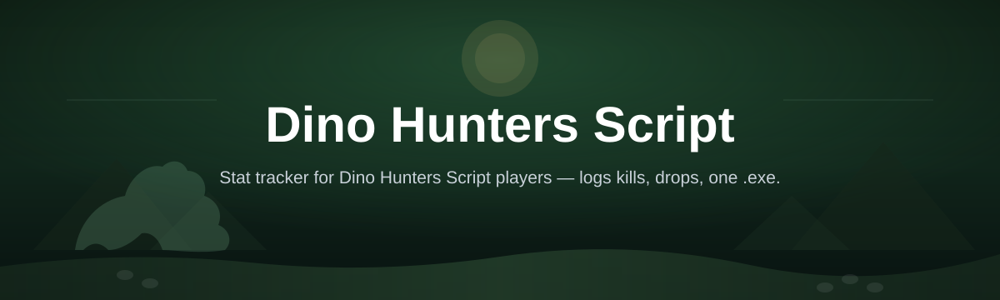
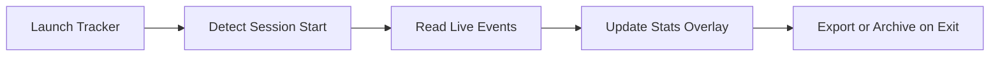

# dino-hunters-stat-tracker

*Live stat tracking for Dino Hunters players who want to know exactly how their runs are going, without digging through menus.*

**Quick start:** 1) Open the landing page → 2) Download the current build → 3) Run it alongside Dino Hunters. Full details below.

## What this is

dino-hunters-stat-tracker is a standalone Windows companion tool built around the Dino Hunters Script community's need for clearer, faster feedback on in-game runs. Instead of guessing how a hunt went, it reads and organizes the numbers that matter — kills, rarities, session length, drop patterns — and presents them in a plain, readable window you can glance at while you play.

The project started as a personal utility for tracking long grind sessions and grew once other players in the Dino Hunters Script community asked for the same visibility. It does not modify the game client and is not a gameplay automation tool — it is a companion process that observes and reports, aimed at players who want data, not shortcuts.

  

The button above opens the project's landing page, where the current build is available to download.

## Who it is for

- **Grind-focused players** who run long Dino Hunters sessions and want a record of what happened.
- **Trading and drop analysts** trying to spot patterns in rarity distribution over time.
- **Community moderators and event organizers** who need shareable session summaries.
- **New contributors** looking for a small, approachable Windows project to learn from.
- **Returning players** who want to compare current stats against older sessions.

## What you can do

- **Track kills and session time** in a live, always-on-top window.
- **Log rarity distribution** across a full run so patterns are easy to spot.
- **Export session summaries** to a simple text or CSV file for later review.
- **Compare two sessions side by side** to see if a change actually helped.
- **Set custom session labels** so long-term tracking stays organized.
- **Run quietly in the background** without interrupting normal gameplay.
- **Reset or archive stats** between sessions without losing history.
- **View a running total** across all recorded sessions, not just the current one.

## Getting started

1. Open the landing page using the download button above.
2. Download the latest build for Windows.
3. Extract the download to a folder of your choice.
4. Launch the tracker before or during your Dino Hunters session.
5. Check the on-screen panel for live stats as you play.

## Requirements

- Windows 10 or Windows 11 (64-bit).
- No installer, runtime, or build toolchain required — the tracker runs as a standalone executable.
- A working Dino Hunters client already installed and running.
- Roughly 50 MB of free disk space.

## How it works

1. The tracker launches as a lightweight background process.
2. It watches for relevant in-game events as they occur during your session.
3. Each event is parsed and added to the current session's running totals.
4. Stats are displayed live in a compact overlay window.
5. On session end, totals can be exported or archived for later comparison.

## FAQ

**Is dino-hunters-stat-tracker an official Dino Hunters Script tool?**
No. It is an independent, community-built companion tool and is not affiliated with the official game developers.

**Does this tool automate gameplay or give an unfair advantage?**
No. It only reads and displays information about your own session; it does not act on your behalf in-game.

**Will this work if I already use other Dino Hunters Script tools?**
In most cases yes, since the tracker only observes events and does not modify game files. If you notice conflicts, try running the tracker on its own first.

**Can I use this on macOS or Linux?**
Not currently. The build is compiled specifically for Windows 10/11.

**Where can I find the latest version?**
Always through the download button on this page, which points to the official landing page for current builds.

## Troubleshooting

- **Tracker window doesn't appear:** Confirm Dino Hunters is already running before launching the tracker, then relaunch it.
- **Stats aren't updating:** Some events take a few seconds to register after a session starts; wait briefly before assuming it's stuck.
- **Antivirus flags the executable:** This is a common false positive for unsigned Windows tools; verify you downloaded from the official landing page linked above.
- **Export file is empty:** Make sure the session was active for at least a few minutes before exporting, so there is data to save.

## License

Released under the [MIT License](LICENSE). This project is provided as-is, without warranty of any kind, and is maintained on a best-effort basis by contributors. Use it at your own discretion.

  

